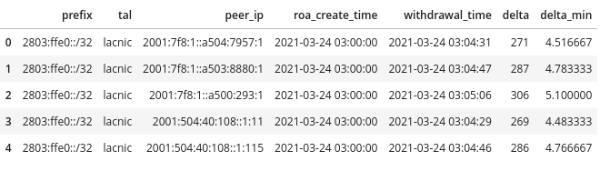
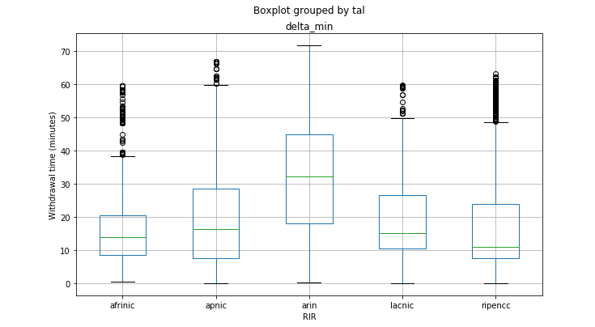

# ROA Propagation time extraction

## Purpose
The purpose of this project extract the propagation time of ROA (Route Origin Authorization) objects into BGP.

On the Internet, networks announce their prefixes (IP address ranges) to other networks through the BGP protocol. However, based on an external database called RPKI containing ROAs, those announcements can be tagged as valid, invalid or not-found. Whenever the announcement of a prefix is tagged as invalid, networks receiving those announcements will drop these prefixes if they are performing Route Origin Validation (ROV). The aim of this project is to capture the BGP propagation time following changes in the RPKI.

## Dataset
In this project, we used 4 datasets.

Dataset 1: We start with getting a list of prefixes from RIB (Routing Information Base) files from [RouteViews](http://archive.routeviews.org/)
Format: Compressed binary format (.bz2)
Numbers of rows : 13914909
```
>>> import pandas as pd
>>> df = pd.read_csv('route-views3-rib.20180501.0000.csv', sep='|')
>>> df.shape
(13914909, 15)
```

Dataset 2: We then need to validate the prefixes against information found in [RPKI](http://ftp.ripe.net/rpki)
Format: csv
```
root@aaee69ee5086:/home/workspace# wc -l /root/.cache/rov/db/rpki//2022/4/17/*
    4646 /root/.cache/rov/db/rpki//2022/4/17/afrinic.csv
   89706 /root/.cache/rov/db/rpki//2022/4/17/apnic.csv
   54368 /root/.cache/rov/db/rpki//2022/4/17/arin.csv
   21819 /root/.cache/rov/db/rpki//2022/4/17/lacnic.csv
  157326 /root/.cache/rov/db/rpki//2022/4/17/ripencc.csv
  327865 total
```

The csv files are loaded into a `radix` tree to enable fast-lookup of a prefix. The radix tree is commonly used for routing table lookups. It efficiently stores network prefixes of varying lengths and allows fast lookups of containing networks.

Dataset 3: We then need to extract which ROAs made the prefixes in (1) **Invalid**, for this we use a [custom-built API](http://45.129.227.23:5000/search?prefix=199.91.96.0/24)
Format: json

```
{
    "data": [
        {
            "asn": "136744",
            "ipprefix": "199.91.96.0/24",
            "maxlength": 24,
            "notafter": "2024-05-13T04:00:00",
            "notbefore": "2021-09-08T04:00:00",
            "tal": "arin"
        },
        {
            "asn": "1239",
            "ipprefix": "199.91.96.0/21",
            "maxlength": 24,
            "notafter": "2022-09-08T04:00:00",
            "notbefore": "2021-09-08T04:00:00",
            "tal": "arin"
        }
        ],
    "message": "ROA(s) found",
    "status": 200
}
```

Dataset 4: We then extract the time at which a "Withdraw" message was found in BGP. For this we used [PyBGPStream](https://bgpstream.caida.org/docs/install/pybgpstream)
Format: API

```
    stream = pybgpstream.BGPStream(
        from_time=starttime, until_time=t2.isoformat(),
        collectors=["rrc00","rrc14"],
        record_type="updates",
        filter="prefix " + prefix
    )
```

## Output
Our final output is a csv file containing the following information "prefix", "tal", "peer_ip", "roa_create_time", "withdrawal_time", "delta".
We are mainly interested in the "delta" value i.e. the ROA propagation time.
```
df = pd.read_csv('data/results.csv', header='infer', dtype={'delta':np.int32}, parse_dates=['roa_create_time','withdrawal_time'], skip_blank_lines=True)
df['delta_min'] = df.delta/60
df.head()
```



## Data Analysis
We then analyse the results first by creating a box plot to understand the distribution (min, max and median) values for each category (RIR).
This is achieved by running:
```
fig, ax = plt.subplots(figsize=(10, 6))
df.boxplot(by ='tal', column =['delta_min'], grid = False, ax=ax)

ax.set_xlabel("RIR")
ax.set_ylabel("Withdrawal time (minutes)")
ax.grid(True)

plt.show()
```

    
## Project Structure
- **data** folder nested at the home of the project, where all needed data reside.
- **Capstone Project.ipynb**  jupyter notebook that was used for building the ETL pipeline.
- **rib.py** the code used to download a RIB file
- **rov.py** the code used to validate prefixes in the RIB file
- **roa.py** the code used to extract ROAs from the API for a given prefix
- **bgp.py** the code used to check for withdrawal messages on the global routing table
- **etl.py** the code to automate the ETL process
- **README.md** current file, provides description of the project.
    
# Build Instructions
Run `bash install.sh`

# Run Instructions
Run `python etl.py`

# Setup Instructions
To automate the process, a cronjob can be setup to collect the data on a regular basis (e.g. monthly)

# Choice of tools and technologies for the project.
* Python for data processing 
* Pandas - exploratory data analysis and loading of CSV files
* Matplotlib - Visualization our results
* Apache Cassandra : open source NoSQL distributed database is ideal to hold a flat-file structure on which simple operations such as select and group by can be perfomed.


## Data Model

For our data model, we are using a *flat-file database* structure. We have an *input* table (rib) and an *output* table (roa_timing) which contains the information we are interested for our final analysis.

We first start we the RIB table.

Table 'rib': (PrimaryKey : prefix,origin_asn)

| Field           | Type      | Description |
|-----------------|-----------|-------------|
| prefix          | text      |  IP Address range in CIDR notation         |
| origin_asn      | int       |  ASN originating the prefix           |

For each row in the RIB table, we add an additional column called **status**: (PrimaryKey : prefix,origin_asn; ForeignKey : prefix)

| Field           | Type      | Description |
|-----------------|-----------|-------------|
| prefix          | text      |  IP Address range in CIDR notation           |
| origin_asn      | int       |  ASN originating the prefix           |
| status          | text      |  RPKI status of announcement           |

Table 'roa_timing': (PrimaryKey : prefix,peer_ip; ForeignKey : prefix)

| Field           | Type      | Description |
|-----------------|-----------|-------------|
| prefix          | text      | IP Address range in CIDR notation |
| tal             | text      | Source RIR            |
| peer_ip         | inet      | Peer IP Address            |
| roa_create_time | timestamp | Not valid before time            |
| withdrawal_time | timestamp | Withdrawal time            |
| delta           | float     | Time difference in seconds            |
| delta_min       |           | Time difference in minutes            |


## Data Quality Checks
To be ensure that our data has been loaded into tables in the appropriate manner, we explicity use the following options:

* In the *rib* table we have a primary key constraint on *prefix* and *origin_asn*. This helps use make sure there is no duplicate line with the same prefix/origin_asn pair in the DB.
* When loading a CSV file into a Pandas Dataframe, we use the `skip_blank_lines=True` to skip rows with a NaN value in any column.
* In *rib.py* we perform a `df.drop_duplicates(['prefix','origin_asn'],inplace=True)` to drop all duplicate rows


# Propose how often the data should be updated and why.
For this project, we are interested in collecting once a month. For this we will setup a cronjob accordingly.
`0 0 1 * * python etl.py`

# Possible future scenarios:
## The data was increased by 100x.
If the data was increase by 100x, we will have to look into big data storage systems. For this we could consider the use of S3 buckets, process the data using Spark and load the data back into s3 as a set of dimensional tables in spark parquet files. We can use AWS EMR that will allow Spark to be scaled to process data using multiple clusters.

## The data populates a dashboard that must be updated on a daily basis by 7am every day.
Since we are handling a time-series type of data, we can eventually think of implementing this on a Grafana dashboard powered by an Influx DB. The daily update can be handled by either a cronjob or we can use Apache Airflow for pipelining the ETL processes. 

## The database needed to be accessed by 100+ people.
For this we can make use of cloud-based data warehouse solutions such as AWS Redshift. Amazon Redshift is the most popular and fastest cloud data warehouse and is a fully-managed petabyte-scale cloud based data warehouse product designed for large scale data set storage and analysis.  AWS Redshift can handle up to 500 connections by default. For hyper scaling, other technologies such as Amazon RDS Read Replicas can be used to scale the database tier or AWS Elastic Load Balancing can be used for the application tier.